# 🛡️ Jan Sahay (जन सहाय) — AI-Powered Citizen Assistance Platform
### *A 10-Day Journey Building a Real-Time, Multilingual Voice Agent for Financial Safety, Government Welfare & Cyber Fraud Containment*


---

## 📖 The Story That Started It All

Imagine a small shopkeeper in Delhi named **Ramesh**.

One evening, Ramesh receives a message on his phone:
> *"Your bank account will be blocked tonight. Verify your KYC immediately by clicking the link below."*

Anxious and rushed, he clicks the link. Within a few minutes, he realizes the message was fake and an unauthorized transaction has taken place.


Now he is gripped with panic and urgent questions:
- *What should he do right now?*
- *Who should he contact?*
- *Can he report the fraud and freeze his account before the money is moved?*
- *Are there government schemes or emergency funds that could help his family recover?*

The information exists across various portals and government websites—but finding the right, authoritative guidance during a crisis is overwhelmingly difficult. Most portals are text-heavy, loaded with bureaucratic jargon, or only in English.

That very question became the inspiration behind **Jan Sahay (जन सहाय)**: a citizen-focused, voice-first AI platform built to make **financial literacy, fraud prevention, government welfare schemes, and complaint guidance** accessible to every citizen. Instead of navigating complex portals or waiting in queues, citizens can simply talk naturally in Hindi, English, or Hinglish to an empathetic AI voice assistant.

This document outlines the complete story, architecture, development log, challenges solved, and setup guide for Jan Sahay over **10 Days of Building Voice Agents**.

---

## 🏛️ The 4 Core Functional Pillars

Rather than building a generic open-ended chatbot, Jan Sahay is structured around four foundational pillars designed specifically for citizen welfare and digital safety:

```plaintext
                  ┌──────────────────────────────┐
                  │          JAN SAHAY           │
                  │   Citizen Voice Assistant    │
                  └──────────────┬───────────────┘
                                 │
     ┌──────────────────┬────────┴─────────┬──────────────────┐
     ▼                  ▼                  ▼                  ▼
┌──────────────┐ ┌──────────────┐ ┌──────────────┐ ┌──────────────┐
│  Financial   │ │    Fraud     │ │  Government  │ │  Complaint   │
│   Literacy   │ │  Prevention  │ │   Schemes    │ │  Assistance  │
└──────────────┘ └──────────────┘ └──────────────┘ └──────────────┘
```

1. **💰 Financial Literacy:** Jargon-free guidance on savings accounts, budgeting fundamentals, formal credit, interest rates, and long-term financial planning.
2. **🛡️ Fraud Prevention:** Real-time coaching on OTP/PIN safety, identifying phishing messages, fake caller identification, and avoiding malicious screen-sharing APKs.
3. **🏛️ Government Welfare Schemes:** Deterministic eligibility calculations and checklists for **PMJDY**, **PMSBY**, **PMJJBY**, **Atal Pension Yojana (APY)**, **Sukanya Samriddhi (SSY)**, **PM Mudra Yojana**, and **PM-KISAN**.
4. **📞 Complaint & Emergency Triage:** Structured step-by-step incident response for cybercrime reporting (**1930 / cybercrime.gov.in**), bank dispute filing for RBI Zero-Liability protection, and consumer forum escalations.

---

## 🏗️ System Architecture & Real-Time Voice Flow

Jan Sahay achieves sub-500ms voice turnaround times using real-time WebRTC audio streaming, streaming transcription, low-latency LLM reasoning, and natural Indian voice synthesis.

### 1. Real-Time Audio Pipeline Flow

```mermaid
flowchart LR
    A["🎙️ Citizen Speaks Audio"] --> B["⚡ LiveKit WebRTC<br/>Real-Time Transport"]
    B --> C["🗣️ Deepgram Nova-2<br/>Streaming Speech-to-Text"]
    C --> D["🧠 Google Gemini AI<br/>Reasoning & Intent"]
    D --> E["💰 Financial Rules Engine<br/>+ Caller Memory DB"]
    E --> F["🔊 Murf Falcon TTS<br/>Ultra-Fast Indian Voices"]
    F --> G["🗣️ Natural Voice<br/>Playback to Citizen"]

    G -.-> A

    style A fill:#1E293B,stroke:#38BDF8,color:#fff
    style B fill:#0284C7,stroke:#38BDF8,color:#fff
    style C fill:#0D9488,stroke:#2DD4BF,color:#fff
    style D fill:#6366F1,stroke:#A5B4FC,color:#fff
    style E fill:#D97706,stroke:#FDE68A,color:#fff
    style F fill:#EA580C,stroke:#FDBA74,color:#fff
    style G fill:#10B981,stroke:#6EE7B7,color:#fff
```



### 2. Complete Multi-Tier Architecture

```plaintext
                        ┌──────────────────────┐
                        │        CITIZEN       │
                        └──────────┬───────────┘
                                   │ (Speaks / Listens)
                                   ▼
                        ┌──────────────────────┐
                        │ Jan Sahay Web Portal │
                        │   (Next.js Client)   │
                        └──────────┬───────────┘
                                   │ WebRTC Audio Stream (LiveKit)
                                   ▼
                        ┌──────────────────────┐
                        │ LiveKit Voice Agent  │
                        └─────┬──────────┬─────┘
                              │          │
        ┌─────────────────────┘          └─────────────────────┐
        ▼                                                      ▼
┌───────────────┐                                      ┌───────────────┐
│   Deepgram    │ (Audio to Text)                      │  Murf Falcon  │ (Text to Audio)
│  Nova-2 STT   │                                      │   (TTS API)   │
└───────┬───────┘                                      └───────▲───────┘
        │                                                      │
        ▼                                                      │
┌──────────────────────────────────────────────────────────────┴───────┐
│                     Google Gemini Orchestrator                       │
└───────┬───────────────────────────────┬──────────────────────────────┘
        │                               │
        ▼                               ▼
┌───────────────┐               ┌───────────────┐
│ Caller Memory │               │ Rules Engine  │
│ (SQLite DB)   │               │ (Deterministic│
│               │               │ Scheme Logic) │
└───────────────┘               └───────────────┘
```

---

## 🎙️ Meet the Team of AI Specialists

Jan Sahay uses a multi-agent federation where a main intake guide dynamically hands off the conversation to dedicated domain specialists, matching their persona with the optimal **Murf Falcon voice profile**:

| Specialist Avatar | Agent Role & Domain | Voice Profile | Supported Locales | Key Capabilities |
| :--- | :--- | :--- | :--- | :--- |
| **Anisha** | **Main Intake & General Guide** | `Anisha` (Murf Falcon) | `en-IN` / `hi-IN` | Warm intake, 2-turn scoping, personalized greetings, banking basics. |
| **Samar** | **Cyber Safety & Emergency Containment** | `Samar` (Murf Falcon) | `en-IN` | Golden hour containment, 1930 reporting, bank helpline lookup. |
| **Pooja** | **Government Schemes & Pension Guide** | `Pooja` (Murf Falcon) | `en-IN` / `hi-IN` | APY pension calculators, Sukanya Samriddhi (8.2%), PMJDY/PMSBY/PMJJBY. |
| **Samar** | **Micro-Credit & Business Loans** | `Samar` (Murf Falcon) | `en-IN` | PMMY Mudra loans (Shishu, Kishore, Tarun), PM SVANidhi vendor loans. |
| **Palak** | **Agri-Financial & Crop Insurance** | `Palak` (Murf Falcon) | `en-IN` / `hi-IN` | PMFBY 72-hr crop loss reporting, PM-KISAN e-KYC status, Kisan Credit Cards. |
<iframe src="https://www.linkedin.com/embed/feed/update/urn:li:ugcPost:7493954142743433216?collapsed=1" height="539" width="504" frameborder="0" allowfullscreen="" title="Embedded post"></iframe>
---

## 📅 10-Day Development Journey & Log


### 🟢 Day 1 — The Problem: Financial Confusion Is Everywhere
- **Key Realization**: Financial information is available, but accessibility is broken. Ordinary citizens struggle with banking, digital safety (UPI fraud/phishing), welfare schemes, and dispute recourse.
- **Objective**: Build an AI assistant that feels less like a search engine and more like a patient, empathetic citizen-support counselor.
- **Core Pillars Defined**: Simple, Conversational, Multilingual, Trustworthy, and Voice-first.

### 🟢 Day 2 — Designing the Citizen Experience
- Structured the core 4-pillar interaction model (Financial Literacy, Fraud Prevention, Government Schemes, Complaint Assistance).
- Defined prompt rules prohibiting hallucinations and outlining empathetic responses for users facing financial distress.

### 🟢 Day 3 — Giving the AI a Memory
- **Problem**: Stateless chatbots suffer from amnesia. If Ramesh calls today about his daughter's education fund and calls back tomorrow, repeating context causes friction.
- **Solution**: Built the **Caller Memory Database** (`backend/caller_data.db` using SQLite) with schema for `user_id`, `name`, `language_pref`, `demographic_facts`, and `discussed_schemes`.
- **Privacy First**: Integrated explicit verbal consent checks (*"May I remember this for your next call?"*) before storing non-PII demographic facts.

### 🟢 Day 4 — Building the Government Scheme Knowledge Layer
- **Architecture Rule**: *LLM handles dialogue $\rightarrow$ Deterministic Rules Engine guarantees official policy truth.*
- Implemented exact formula calculators for:
  - **PMJDY**: Zero balance, RuPay debit card, ₹2L accident insurance cover.
  - **PMSBY**: Accidental death/disability cover (Age 18–70, ₹20/year premium, ₹2 Lakh cover).
  - **PMJJBY**: Life insurance cover (Age 18–50, ₹436/year premium, ₹2 Lakh cover).
  - **APY**: Atal Pension Yojana pension slabs (₹1,000–₹5,000/mo at age 60 based on entry age).
  - **SSY**: Sukanya Samriddhi Yojana (Girl child < 10 yrs, current 8.2% interest, tax exemptions).

### 🟢 Day 5 — Turning Text Into a Real-Time Voice Conversation
- Integrated **LiveKit WebRTC Agents** with **Deepgram Nova-2 STT** and **Murf Falcon TTS**.
- Enabled streaming bidirectional audio with Silero VAD (Voice Activity Detection) for seamless turn detection and low-latency interruptions.

### 🟢 Day 6 — Making Jan Sahay Multilingual & Code-Mixed
- Configured STT and TTS mappings for English (`en-IN`), Hindi (`hi-IN`), and conversational Hinglish.
- Enforced single-language response purity per turn to eliminate double-audio slash artifacts (`"Hello / नमस्ते"`).

### 🟢 Day 7 — Fraud Prevention as a First-Class Feature
- Implemented **Immediate Action Matrix** for cyber safety:
  - Strict alerts on OTP/PIN confidentiality.
  - Screen-sharing warning triggers (AnyDesk, TeamViewer).
  - Unverified QR code and UPI PIN receiving scam alerts.
  - **Golden Hour Protocols** to halt fund movement.

### 🟢 Day 8 — Action-Oriented Complaint Assistance
- Developed structured escalation protocols:
  1. **Banking Disputes**: Card freeze, dispute filing within 3 days for RBI Zero-Liability.
  2. **Cybercrime Reporting**: Guided walkthrough for `cybercrime.gov.in` and National Helpline **1930**.
  3. **Human Escalation**: Generates unique escalation reference IDs (e.g., `ESC-XXXXX`) logged to SQLite for officer review.

### 🟢 Day 9 — Building the Web Portal & Telemetry Dashboard
- Developed a high-performance **Next.js** web application with a single-click 🎙️ **"Start Talking"** interface.
- Built real-time telemetry tracking turn latency, outcome classifications (resolved/escalated), and active escalation queues at `/api/dashboard`.
- Added telephony SIP outbound calling capability (`backend/src/outbound_call.py`).

### 🟢 Day 10 — Open-Source Release & Architecture Documentation
- Packaged repository with automated startup scripts (`start_app.ps1` / `start_app.sh`), comprehensive API documentation, and architecture diagrams.

---

## 🚧 Challenges Faced & How We Solved Them

### 1. 🌐 Multilingual & Language Switching Inconsistencies
* **The Problem**: In bilingual English/Hindi environments, the agent sometimes randomly replied in Hindi to an English prompt or switched languages mid-conversation without user intent.
* **How We Solved It**:
  - Implemented session-level language tracking in SQLite memory.
  - Enforced strict prompt guidelines: detect user language preference, maintain it consistently across turns, and switch languages only when explicitly requested by the citizen.
  - Required native Devanagari script output for Hindi responses to ensure Murf Falcon TTS synthesizes authentic intonation.

### 2. 🧠 Hallucination-Free Financial Reasoning
* **The Problem**: Financial queries involving age limits, cutoff dates, premium tiers, and pension returns must be 100% accurate. LLMs can hallucinate calculation schedules.
* **How We Solved It**:
  - Decoupled conversational empathy from calculations.
  - Gemini extracts parameters (age, target pension, child age) and calls deterministic Python functions (`calculate_apy_contribution`, `get_scheme_details`).
  - Verified math is returned to Gemini to format as a spoken response.

```plaintext
Citizen Question ──> Gemini AI (Intent Extraction) ──> Python Rules Engine ──> Verified Result ──> Murf Voice
```

### 3. 🔄 Dynamic Voice Profile Switching in WebRTC
* **The Problem**: Tearing down WebRTC rooms when switching from Anisha to Samar or Pooja caused noticeable audio stutters and 2–3s delays.
* **How We Solved It**: Kept the WebRTC audio transport live while dynamically swapping the Murf Falcon voice profile parameters in-flight during tool execution.

### 4. 🛡️ Accidental PII Memorization
* **The Problem**: Panicked callers reporting fraud frequently blurt out card numbers or PINs.
* **How We Solved It**: Built an automated sanitization regex layer in `save_caller_facts` and `create_escalation` that automatically scrubs card numbers, OTPs, PINs, and passwords before database commits.

---

## 🔮 What's Next on the Roadmap

1. **📞 Telephony & IVR Toll-Free Access**:
   - SIP Trunking integration with Exotel / Twilio so citizens without smartphones can dial a toll-free number from any basic feature phone.
2. **🗣️ Hyper-Local Regional Dialects**:
   - Expand beyond Hindi/English to regional languages (Bhojpuri, Maithili, Bengali, Marathi, Tamil, Telugu).
   - Acoustic noise suppression tuned for busy Indian environments (markets, bus stops, railway stations).
3. **📄 DigiLocker & Voice-Guided Application**:
   - Voice OTP authorization for instant eligibility verification via DigiLocker.
   - Voice-guided form pre-filling for PM-KISAN and Sukanya Samriddhi portals.
4. **📲 Multi-Channel Follow-ups (WhatsApp / SMS)**:
   - Automated post-call summary SMS with verified helpline links, scheme forms, and grievance reference IDs.
   - Instant downloadable PDF checklist generated at the end of the voice call.
5. **🚨 Proactive Outbound Alerts**:
   - Automated voice alerts when subsidy installments (PM-KISAN, APY pensions) are credited.
   - Geo-targeted voice broadcasts warning citizens about emerging phishing scams in their district.

---

## 🛠️ Step-by-Step Quickstart Guide

### Prerequisites
- **Python** 3.10+
- **[uv](https://docs.astral.sh/uv/)** (Fast Python package manager)
  ```powershell
  # Windows (PowerShell)
  powershell -ExecutionPolicy ByPass -c "irm https://astral.sh/uv/install.ps1 | iex"
  
  # macOS/Linux
  curl -LsSf https://astral.sh/uv/install.sh | sh
  ```
- **Node.js** 18+ and **pnpm**
  ```bash
  npm install -g pnpm
  ```
- **LiveKit Cloud Account**: [cloud.livekit.io](https://cloud.livekit.io/)
- **Murf AI API Key**: [murf.ai/api/dashboard](https://murf.ai/api/dashboard)
- **Google AI Studio API Key**: [aistudio.google.com](https://aistudio.google.com/)
- **Deepgram API Key**: [deepgram.com](https://deepgram.com/)

---

### Step 1: Clone the Repository & Configure Secrets

```bash
git clone https://github.com/your-username/jan-sahay-voice-agent.git
cd jan-sahay-voice-agent/murf-livekit-starter
```

Create `.env.local` files in both `backend/` and `frontend/`:

**`backend/.env.local`**:
```env
LIVEKIT_URL=wss://your-project.livekit.cloud
LIVEKIT_API_KEY=your_livekit_key
LIVEKIT_API_SECRET=your_livekit_secret
MURF_API_KEY=your_murf_falcon_api_key
DEEPGRAM_API_KEY=your_deepgram_api_key
GOOGLE_API_KEY=your_gemini_api_key
```

**`frontend/.env.local`**:
```env
LIVEKIT_URL=wss://your-project.livekit.cloud
LIVEKIT_API_KEY=your_livekit_key
LIVEKIT_API_SECRET=your_livekit_secret
```

---

### Step 2: Install Backend Dependencies

```bash
cd backend
uv sync
uv run python src/agent.py download-files
```

---

### Step 3: Install Frontend Dependencies

```bash
cd ../frontend
pnpm install
```

---

### Step 4: Run the Application

#### Option A: One-Click Startup Script (Recommended)

```bash
# Windows (PowerShell):
.\start_app.ps1

# Linux / macOS:
chmod +x start_app.sh
./start_app.sh
```

#### Option B: Separate Terminals

```bash
# Terminal 1: Backend Voice Worker
cd backend
uv run python src/agent.py dev

# Terminal 2: Frontend Web UI & Dashboard
cd frontend
pnpm dev
```

Open **`http://localhost:3000`** in your browser, click **"Start talking"**, grant microphone access, and begin speaking with **Anisha**!

---

## 📁 Repository Structure

```plaintext
jan-sahay/
├── README.md                           # Main documentation & 10-day build story
└── murf-livekit-starter/
    ├── start_app.ps1                   # Windows 1-click startup script
    ├── start_app.sh                    # Linux/macOS 1-click startup script
    ├── backend/
    │   ├── caller_data.db              # SQLite Caller Memory & Escalations DB
    │   ├── src/
    │   │   ├── agent.py                # Main LiveKit Agent & Multi-Specialist logic
    │   │   ├── db.py                   # SQLite memory CRUD, calculators & PII sanitizer
    │   │   ├── prompt.py               # Anisha persona & system guardrails
    │   │   ├── specialist_prompts.py   # Prompts for Samar, Pooja, and Palak
    │   │   └── outbound_call.py        # Telephony SIP outbound dialer
    │   └── pyproject.toml              # uv Python dependencies
    └── frontend/
        ├── app/
        │   ├── page.tsx                # Next.js Voice Assistant Web Interface
        │   └── api/dashboard/route.ts  # Observability & Escalations API
        └── package.json                # Frontend dependencies (pnpm)
```

---

